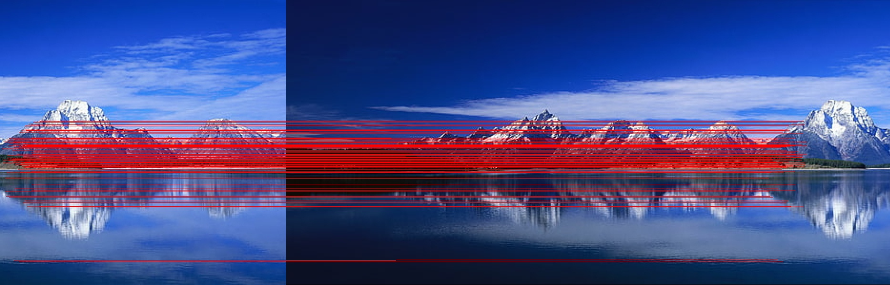

# VR Assingment 1 
## Libraries Required:
1. OpenCV
2. Numpy
## Steps To Run
Steps to run the code are as follows:
1. clone the repository in your local machine.
``` git clone https://github.com/Siddhesh-Deshpande/VR_Assingment1_Siddhesh_Deshpande_IMT2022080.git```
2. Install the required libraries  .
	Note - You need to have conda environment ready.
	1. ```conda activate <environment_name>```
	2. ```pip install opencv-python numpy opencv-contrib-python```
3. For the Part 1 run the following command
``` python3 part1.py```
4. For the Part 2 run the following command
```python3 part2.py	```

## Output Images 
### Part 1
\
Segmented coins output images
|  |  |  |
|---|---|---|
|  |  |  | 
||

### Part 2





## Report 
The Report is [here](./VR_Assingment1.pdf)
